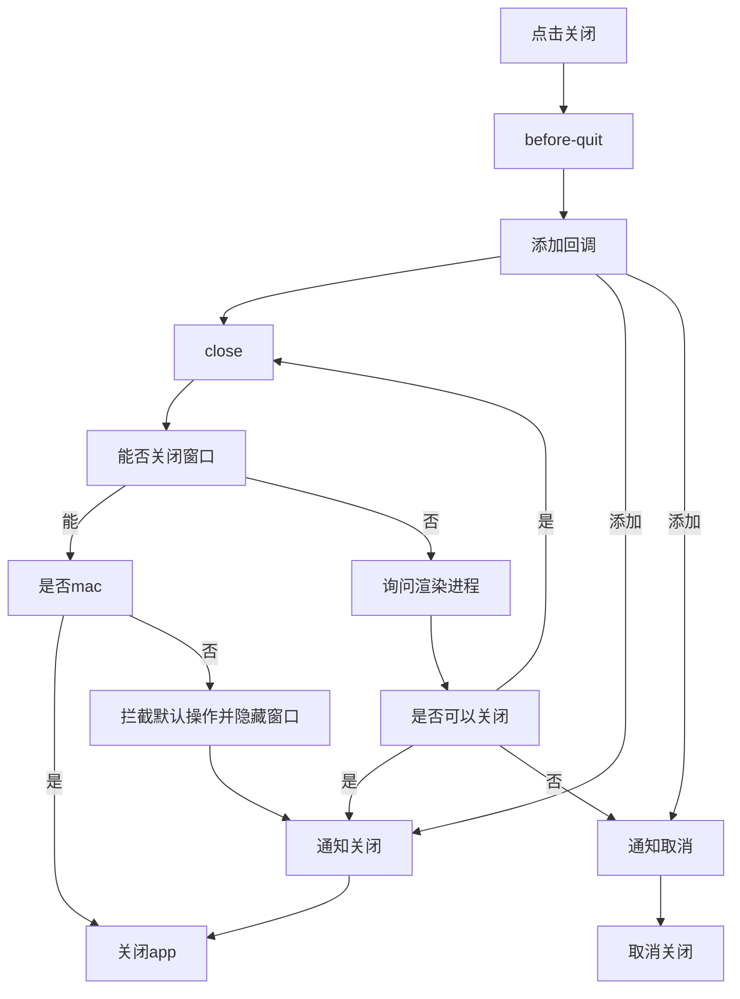

## 关闭操作流程图

```mermaid
flowchart TD
  点击关闭 --> before-quit --> 添加回调 --> close --> 能否关闭窗口

  能否关闭窗口 --> |能| 是否mac --> |是| 关闭app
  能否关闭窗口 --> |否| 询问渲染进程 --> 是否可以关闭

  是否可以关闭 --> |是| close
  是否可以关闭 --> |是| 通知关闭
  是否可以关闭 --> |否| 通知取消


  添加回调  --> |添加|通知关闭 --> 关闭app

  添加回调 --> |添加|通知取消  -->  取消关闭

  是否mac --> |否| 拦截默认操作并隐藏窗口  -->  通知关闭

 

```
